## Project "Search and Sample Return" by Ian Logan
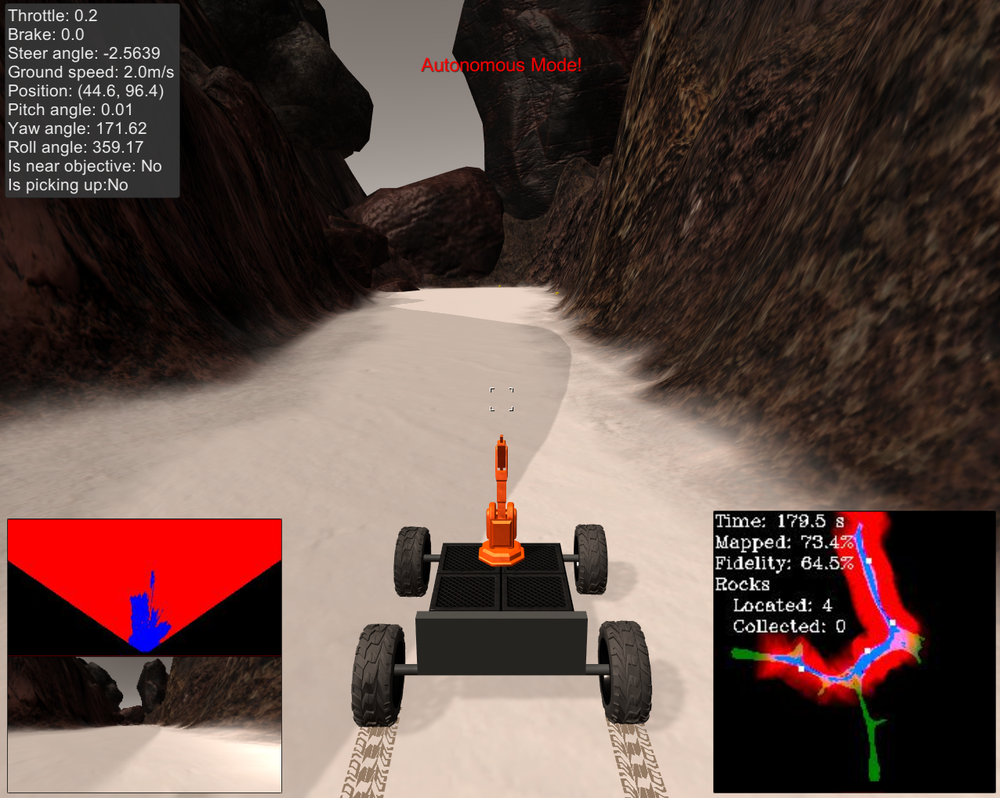

**The goals / steps of this project are the following:**  

**Training / Calibration**  

* Download the simulator and take data in "Training Mode"
* Test out the functions in the Jupyter Notebook provided
* Add functions to detect obstacles and samples of interest (golden rocks)
* Fill in the `process_image()` function with the appropriate image processing steps (perspective transform, color threshold etc.) to get from raw images to a map.  The `output_image` you create in this step should demonstrate that your mapping pipeline works.
* Use `moviepy` to process the images in your saved dataset with the `process_image()` function.  Include the video you produce as part of your submission.

**Autonomous Navigation / Mapping**

* Fill in the `perception_step()` function within the `perception.py` script with the appropriate image processing functions to create a map and update `Rover()` data (similar to what you did with `process_image()` in the notebook). 
* Fill in the `decision_step()` function within the `decision.py` script with conditional statements that take into consideration the outputs of the `perception_step()` in deciding how to issue throttle, brake and steering commands. 
* Iterate on your perception and decision function until your rover does a reasonable (need to define metric) job of navigating and mapping.  

---
### Notebook Analysis

#### Summary

The goal of this project is to get a rover to identify rock samples, while mapping out navigable terrain and obstacles in a simulated environment.

#### Functions for Terrain, Obstacles, and Rock Detection
To get the rover to identify obstacles, terrain, and rock samples, it is very important to utilize several helper functions along the way. These functions are the backbone to the rover's computer vision utilization.

##### Perspective Transform

The purpose of `perspect_transform()` is to take in an image from the rover's camera and create a top down view of the environment from it.

###### Input

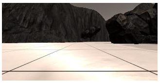

###### Output of 'warped' and 'mask' images

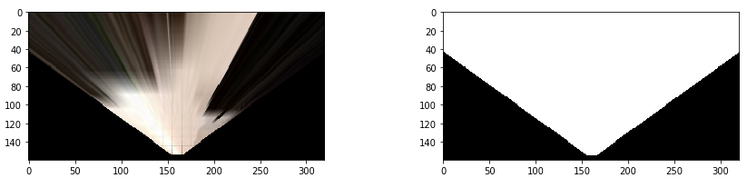

Using OpenCV, we take in an image and use the corners of what would make up a 1x1 meter grid in front of the rover's camera to transform it into a warped perspective with 1x1 meter grids, thus creating an aerial view. We can use this view to create a mask of what is in view of the camera for defining obstacles later.

```python
def perspect_transform(img, src, dst):
           
    M = cv2.getPerspectiveTransform(src, dst)
    
    # keep same size as input image
    warped = cv2.warpPerspective(img, M, (img.shape[1], img.shape[0]))
    
    mask = cv2.warpPerspective(np.ones_like(img[:,:,0]), M, (img.shape[1], img.shape[0]))
    
    return warped, mask
```


##### Color Thresholding

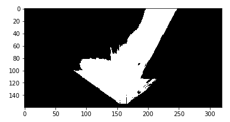

The next step is to take the warped output of the previous function and to apply a color threshold to it. Important to note is that the color of the ground is very light while the surrounding terrain is very dark. We can take advantage of this fact by converting the image to a binary one where white pixels are associated with high intensity rgb color values (ground), and lower intensity values (non-traversable terrain) are seen as black. Pixels below 160 across the rgb color channels fell beneath the color threshold for ridable terrain, so I designed the function with this fact in consideration.

```python
def color_thresh(img, rgb_thresh=(160, 160, 160)):
    # Create an array of zeros same xy size as img, but single channel
    color_select = np.zeros_like(img[:,:,0])
    # Require that each pixel be above all three threshold values in RGB
    # above_thresh will now contain a boolean array with "True"
    # where threshold was met
    above_thresh = (img[:,:,0] > rgb_thresh[0]) \
                & (img[:,:,1] > rgb_thresh[1]) \
                & (img[:,:,2] > rgb_thresh[2])
    # Index the array of zeros with the boolean array and set to 1
    color_select[above_thresh] = 1
    # Return the binary image
    return color_select
```

 

##### Finding Rocks

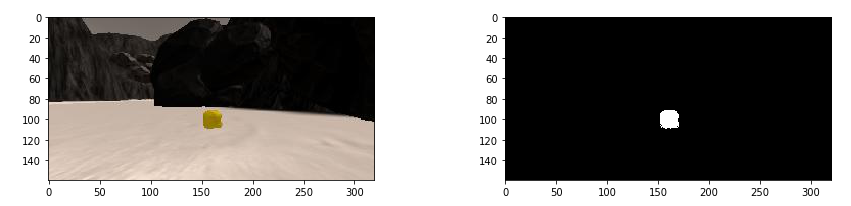

Using similar logic as `color thresh()`, we can also use the `find_rocks()` function to create a threshold for identifying the yellow color of the rocks. Rather than use RGB, HSV serves as a better alternative for isolating the yellow hue of the rocks. With hue determined, we can create a bounding box to determine how bright or dark of a yellow we want the rover to associate with the rocks. Again the image is converted to a binary mask.

```python
def find_rocks(img, hue=96):
    # convert BGR to HSV
    frame = img
    hsv = cv2.cvtColor(frame, cv2.COLOR_BGR2HSV)

    # define upper and lower bound for identifying yellow color
    lower_yellow = np.array([hue-10,130,130])
    upper_yellow = np.array([hue+10,255,255])

    # threshold for only yellow colors
    mask = cv2.inRange(hsv, lower_yellow, upper_yellow)
    
    #convert to binary image
    rockpix1 = (mask>0)
    mask[rockpix1] = 1
    
    return frame, mask
```


##### Coordinate-Transformations

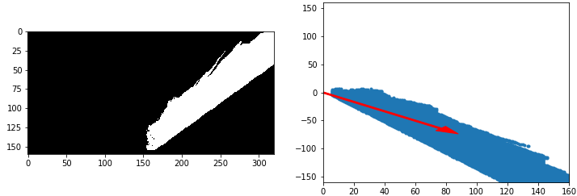

There are several functions that handle the coordinate-transformations. Two of the most notable are `rover_coords()` and `to_polar_coords()`. Illustrated above, these functions utilize the masked image of navigable terrain in order to supply rover-centric coordinates to the rover. By taking the average of the angles produced by the rover-centric image, the rover then has an appropriate yaw angle in which to rotate.

```python
def rover_coords(binary_img):
    # Identify nonzero pixels
    ypos, xpos = binary_img.nonzero()
    # Calculate pixel positions with reference to the rover position being at the 
    # center bottom of the image.  
    x_pixel = np.absolute(ypos - binary_img.shape[0]).astype(np.float)
    y_pixel = -(xpos - binary_img.shape[0]).astype(np.float)
    return x_pixel, y_pixel

# Define a function to convert to radial coords in rover space
def to_polar_coords(x_pixel, y_pixel):
    # Convert (x_pixel, y_pixel) to (distance, angle) 
    # in polar coordinates in rover space
    # Calculate distance to each pixel
    dist = np.sqrt(x_pixel**2 + y_pixel**2)
    # Calculate angle away from vertical for each pixel
    angles = np.arctan2(y_pixel, x_pixel)
    return dist, angles
```


Another important function is `pix_to_world()`. It utilizes `rotate_pix()` and `translate_pix()` in order to map the rover-centric coordinates to the world map.

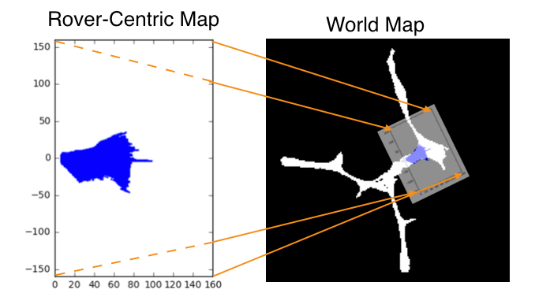

 `rotate_pix()` applies a rotation matrix to the rover centric-pixel value map, so the angle matches up with the way the rover is facing in the world map. Meanwhile, `translate_pix()` adds the x and y values of the rovers position to the computed rotation, so that the two maps align correctly.

```python
def rotate_pix(xpix, ypix, yaw):
    # TODO:
    # Convert yaw to radians
    yaw_rad = (yaw*np.pi)/180
    # Apply a rotation
    xpix_rotated = (xpix * np.cos(yaw_rad)) - (ypix * np.sin(yaw_rad))
    ypix_rotated = (xpix * np.sin(yaw_rad)) + (ypix * np.cos(yaw_rad))
    # Return the result  
    return xpix_rotated, ypix_rotated

# Define a function to perform a translation
def translate_pix(xpix_rot, ypix_rot, xpos, ypos, scale): 
    # TODO:
    # Apply a scaling and a translation
    scale = 10
    xpix_translated = np.int_(xpos + (xpix_rot/scale))
    ypix_translated = np.int_(ypos + (ypix_rot/scale))
    # Return the result  
    return xpix_translated, ypix_translated

# Define a function to apply rotation and translation (and clipping)
# Once you define the two functions above this function should work
def pix_to_world(xpix, ypix, xpos, ypos, yaw, world_size, scale):
    # Apply rotation
    xpix_rot, ypix_rot = rotate_pix(xpix, ypix, yaw)
    # Apply translation
    xpix_tran, ypix_tran = translate_pix(xpix_rot, ypix_rot, xpos, ypos, scale)
    # Perform rotation, translation and clipping all at once
    x_pix_world = np.clip(np.int_(xpix_tran), 0, world_size - 1)
    y_pix_world = np.clip(np.int_(ypix_tran), 0, world_size - 1)
    # Return the result
    return x_pix_world, y_pix_world
```


#### Functionality of `process_image()`  

The next step was to combine this all into one function, `process_image()` , in order for the rover to create a map of it's environment. 

First we perform our perspective transform on an input image.

```python
# TODO: 
# 1) Define source and destination points for perspective transform
source = np.float32([[14, 142], [302 ,142],[200, 96], [120, 96]])
destination = np.float32([[img.shape[1]/2 - dst_size, img.shape[0] - bottom_offset],
                  [img.shape[1]/2 + dst_size, img.shape[0] - bottom_offset],
                  [img.shape[1]/2 + dst_size, img.shape[0] - 2*dst_size - bottom_offset], 
                  [img.shape[1]/2 - dst_size, img.shape[0] - 2*dst_size - bottom_offset],
                  ])

# 2) Apply perspective transform
warped, mask = perspect_transform(img, source, destination)
```


Using `color_thresh()` and `find_rocks()`on the warped output of `perspect_transform()`, we create binary masks of the navigable terrain and rocks, respectively. Then we can use the mask output of `perspect_transform()` to map everything outside of navigable terrain (within camera view) as an obstacle.

```python
# 3) Apply color threshold to identify navigable terrain/obstacles/rock samples
    navi_thresh = color_thresh(warped)
    _, rock_thresh = find_rocks(warped)
    #reverse warp_thresh values and multiply by mask to identify obstacles in view of rover camera
    obs_thresh = np.absolute(np.float32(navi_thresh)-1) * mask
```

###### Navigable Terrain vs Obstacles

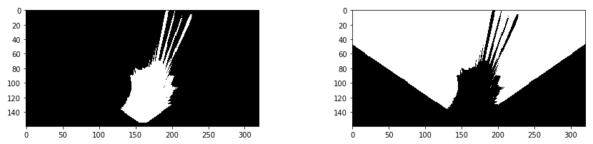


With the three masks created, we convert their pixel values to rover-centric coordinates, as well as world coordinates.

```python
# 4) Convert thresholded image pixel values to rover-centric coords
navi_xpix, navi_ypix = rover_coords(navi_thresh)
rock_xpix, rock_ypix = rover_coords(rock_thresh)
obs_xpix, obs_ypix = rover_coords(obs_thresh)

# 5) Convert rover-centric pixel values to world coords
world_size = data.worldmap.shape[0]
scale = 2 * dst_size

xpos = data.xpos[data.count]
ypos = data.ypos[data.count]
yaw = data.yaw[data.count]

navi_xworld, navi_yworld = pix_to_world(navi_xpix, navi_ypix, xpos, ypos, yaw, world_size, scale) 
obs_xworld, obs_yworld = pix_to_world(obs_xpix, obs_ypix, xpos, ypos, yaw, world_size, scale)
rock_xworld, rock_yworld = pix_to_world(rock_xpix, rock_ypix, xpos, ypos, yaw, world_size, scale)
```


Then we can take the world map to be displayed on screen and attribute color values to the pixels for the various masks. Navigable terrain is blue, obstacles are red, and rocks are white. Since there is some overlap between navigable terrain and obstacles, I chose to overwrite obstacles as blue when deemed navigable as well. For the sake of creating a 25 FPS video, this is a simple and effective way to visualize how the rover will eventually perceive its environment. With that said, we will use a more complex operation in the perception step later on.

```python
# 6) Update worldmap (to be displayed on right side of screen)
    # Example: data.worldmap[obstacle_y_world, obstacle_x_world, 0] += 1
    #          data.worldmap[rock_y_world, rock_x_world, 1] += 1
    #          data.worldmap[navigable_y_world, navigable_x_world, 2] += 1
data.worldmap[navi_yworld, navi_xworld, 2] = 255
data.worldmap[obs_yworld, obs_xworld, 0] = 255
data.worldmap[rock_yworld, rock_xworld, :] = 255

nav_pix = data.worldmap[:,:,2] > 0 
data.worldmap[nav_pix, 0] = 0
```


And finally, we can create a mosaic to get an idea of how the rover maps the environment when fed an image. I used the default view created, but this can be expanded to have various amounts of information for visualization purposes.

```python
# 7) Make a mosaic image, below is some example code
    # First create a blank image (can be whatever shape you like)
output_image = np.zeros((img.shape[0] + data.worldmap.shape[0], img.shape[1]*2, 3))
    # Next you can populate regions of the image with various output
    # Here I'm putting the original image in the upper left hand corner
output_image[0:img.shape[0], 0:img.shape[1]] = img

    # Let's create more images to add to the mosaic, first a warped image
    # Add the warped image in the upper right hand corner
output_image[0:img.shape[0], img.shape[1]:] = warped

    # Overlay worldmap with ground truth map
map_add = cv2.addWeighted(data.worldmap, 1, data.ground_truth, 0.5, 0)
    # Flip map overlay so y-axis points upward and add to output_image 
output_image[img.shape[0]:, 0:data.worldmap.shape[1]] = np.flipud(map_add)

    # Then putting some text over the image
cv2.putText(output_image,"The Rover's POV as it maps its environment", (20, 20), 
            cv2.FONT_HERSHEY_COMPLEX, 0.4, (255, 255, 255), 1)

data.count += 1 # Keep track of the index in the Databucket()

return output_image
```
###### Processed Image Output

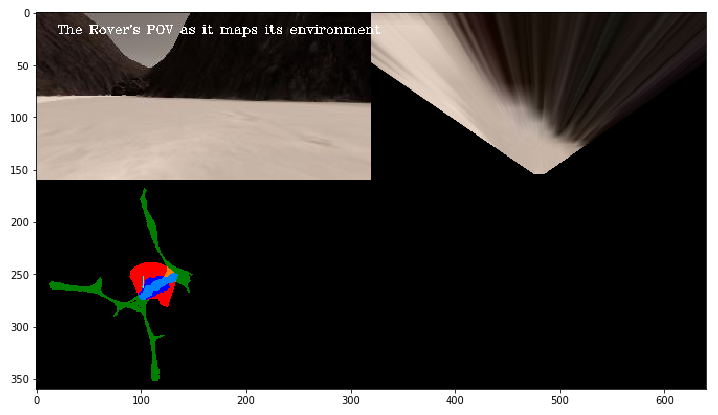

### Autonomous Navigation and Mapping

#### Using `perception_step()` and `decision_step()`

To function properly in simulation, the rover has to take in information about its environment (the perception step) and then make decisions based on that information (the decision step). 

##### Perception Step

In simulation, the rover's state is constantly being updated with important information, such as its (x, y) coordinates, roll, pitch, yaw, images, etc. (more information can be found within drive_rover.py).  We can take advantage of this fact by porting over the same logic from the `process_image()` function to identify where terrain is navigable while mapping out the rover's surroundings to the world map. A key difference is that now we are updating the rover's state to reflect this more complex understanding of the environment, in addition to visualizing the information on screen .

One of these visualization changes is vision_image:

```
Rover.vision_image[:,:,2] = navi_thresh * 255
Rover.vision_image[:,:,0] = obs_thresh * 255
```

We update it so that along with our world map, we can see the rover map obstacles and navigable terrain as it roams in simulation.

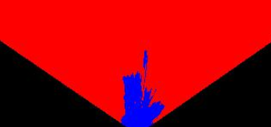


As mentioned earlier, we also update the complexity of how pixels are determined for the worldmap state. We still favor navigable terrain pixels over obstacles, and this will produce better fidelity as the rover maps the environment. 

```python
Rover.worldmap[navi_yworld, navi_xworld, 2] += 10
Rover.worldmap[obs_yworld, obs_xworld, 0] += 1
```
When mapping rock pixels to the world map, they tend to spread out since they get warped during the perspective transform:

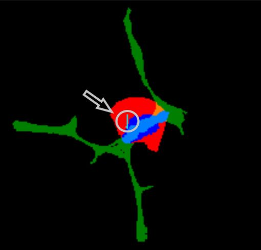

We combat this by converting to polar coordinates, and passing only the center of the rock as a single pixel to the worldmap. In addition, we pass warped pixels to the vision map as well.

```python
if rock_thresh.any():
    rock_xpix, rock_ypix = rover_coords(rock_thresh)
    rock_dist, rock_ang = to_polar_coords(rock_xpix, rock_ypix)
    rock_index = np.argmin(rock_dist)
    rock_xworld, rock_yworld = pix_to_world(rock_xpix, rock_ypix, xpos, ypos, yaw, world_size, scale)
    rock_xcen = rock_xworld[rock_index]
    rock_ycen = rock_yworld[rock_index]

    Rover.worldmap[rock_ycen, rock_xcen, 1] = 255

    Rover.vision_image[:,:,1] = rock_thresh * 255
else:
    Rover.vision_image[:,:,1] = 0
```


And finally, a new, key difference of the `perception_step` is adding polar coordinates to the rover's state, so that it can make use of recorded angles in the decision step.

```python
# 8) Convert rover-centric pixel positions to polar coordinates
# Update Rover pixel distances and angles
    # Rover.nav_dists = rover_centric_pixel_distances
    # Rover.nav_angles = rover_centric_angles
dist, angles = to_polar_coords(navi_xpix, navi_ypix)
Rover.nav_dists  = dist
Rover.nav_angles = angles
```


##### Decision Step

With perception data accumulated, the rover can finally make decisions within its environment. As long as the perception step works properly, then the rover will constantly be supplied with navigation angles, thus initiating its decision tree. I left the decision tree as is, so it is a pretty basic implementation.

When there are navigation angles, the rover executes one of two main decisions. The first is entering its 'forward' mode:

```python
if Rover.nav_angles is not None:
    # Check for Rover.mode status
    if Rover.mode == 'forward': 
        # Check the extent of navigable terrain
        if len(Rover.nav_angles) >= Rover.stop_forward:  
            # If mode is forward, navigable terrain looks good 
            # and velocity is below max, then throttle 
            if Rover.vel < Rover.max_vel:
                # Set throttle value to throttle setting
                Rover.throttle = Rover.throttle_set
            else: # Else coast
                Rover.throttle = 0
            Rover.brake = 0
            # Set steering to average angle clipped to the range +/- 15
            Rover.steer = np.clip(np.mean(Rover.nav_angles * 180/np.pi), -15, 15)
        # If there's a lack of navigable terrain pixels then go to 'stop' mode
        elif len(Rover.nav_angles) < Rover.stop_forward:
                # Set mode to "stop" and hit the brakes!
                Rover.throttle = 0
                # Set brake to stored brake value
                Rover.brake = Rover.brake_set
                Rover.steer = 0
                Rover.mode = 'stop'
```
Essentially, the rover will continue to move forward steering in the direction of navigable terrain. If the rover ever runs into a situation where there are too many obstacle pixels in front of it, it will change to its 'stop' mode.

This leads us to its next decision:

```python
elif Rover.mode == 'stop':
    # If we're in stop mode but still moving keep braking
    if Rover.vel > 0.2:
        Rover.throttle = 0
        Rover.brake = Rover.brake_set
        Rover.steer = 0
    # If we're not moving (vel < 0.2) then do something else
    elif Rover.vel <= 0.2:
        # Now we're stopped and we have vision data to see if there's a path forward
        if len(Rover.nav_angles) < Rover.go_forward:
            Rover.throttle = 0
            # Release the brake to allow turning
            Rover.brake = 0
          # Turn range is +/- 15 degrees, when stopped the next line will induce 4-wheel turning
            Rover.steer = -15 # Could be more clever here about which way to turn
        # If we're stopped but see sufficient navigable terrain in front then go!
        if len(Rover.nav_angles) >= Rover.go_forward:
            # Set throttle back to stored value
            Rover.throttle = Rover.throttle_set
            # Release the brake
            Rover.brake = 0
            # Set steer to mean angle
            Rover.steer = np.clip(np.mean(Rover.nav_angles * 180/np.pi), -15, 15)
            Rover.mode = 'forward'
```
When in stop mode, it will attempt to brake. Once it has done so, it will turn right until suitable navigable terrain has appeared again, thus repeating the process.

Lastly, if there are no navigation angles, the rover will just throttle forward:

```python
else:
    Rover.throttle = Rover.throttle_set
    Rover.steer = 0
    Rover.brake = 0
```
#### 2. Results and Improvements  

##### Specs

Screen Resolution: 1280x1024 windowed

Graphics: Fantastic

FPS: 44

##### Results

For running basic decisions, the rover performs quite well. On it's best run, the rover was able to map roughly 80% of the environment while identifying 5 rock samples before fidelity dropped below 60%. It definitely could achieve better and more consistent results though with a few modifications.

##### Improvements

Occasionally the rover would run into situations where it endlessly turned in a circle while moving forward. I would be curious to try monitoring the amount of time spent turning while throttling, so that if it exceeded x amount of seconds, the rover would stop turning for a time and move forward a few meters. This way it could brake and reevaluate its surrounding environment.

Mapping terrain and obstacle pixels could use some tuning as well. Fidelity can be quite variable and changes a bit between runs. I would like to implement a more precise way of mapping the environment to keep fidelity more consistent.

A natural next step would be to implement rock gathering, as well. I do not think it would be too difficult to have the rover prioritize rock pixels on the warped map and drive towards them before braking for pickup. This could be easier said than done though.

Overall, I went with a pretty basic implementation for the project. I think there is a lot more that can be done to create a more sophisticated model, but it was a very fun learning experience. With a bit more time, I definitely feel confident I could create a better rover!


